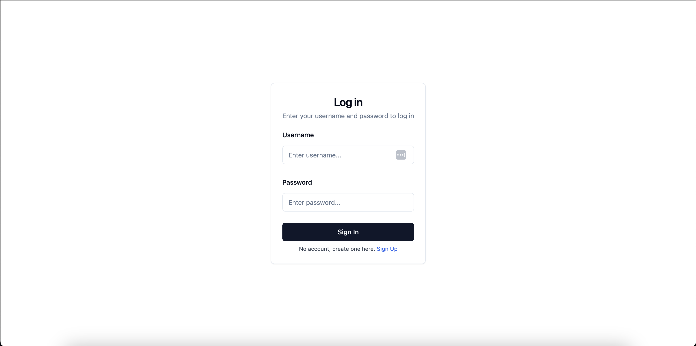
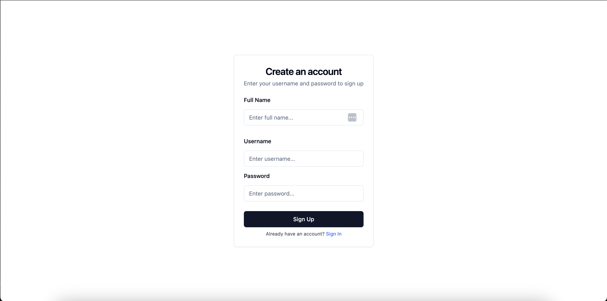

# Next JWT Authentication

## Introduction

This project demonstrates a secure user authentication system using JSON Web Tokens (JWT) with Next.js and Tailwind CSS. The application features a login page with client-side validation, server-side JWT authentication, and a protected dashboard page. Users are authenticated via a JWT, stored securely on the client-side, and utilized to manage sessions.

## Screenshoots





## Demo

[The demo deployed on Versel.](https://next-jwt-nine.vercel.app/)

## 🚀 Getting Started

First, run the development server:

1. Setting up the environment

- Create `.env` file
- Copy data from `.env.example` file

  Variables `MONGODB_URI`,`SECRET` and `EXPIRATION_TIME` are used here.

  `MONGODB_URI` - for simplicity of viewing the task here was used connection string on customized [free mongoDB cluster](https://www.mongodb.com/cloud/atlas).

  You can easily do this yourself by following [the following documentation](https://www.mongodb.com/docs/atlas/tutorial/deploy-free-tier-cluster/).

  `SECRET` - for easy viewing of the task here is already set the value that was generated with the command
  `openssl rand -base64 32` in the computer terminal

  `EXPIRATION_TIME` - is Jwt token expiration time, default to 60 seconds.

2. Install dependencies

   ```bash
   $ npm Install
   ```

3. Start dev server

   ```bash
   $ npm run dev
   # or
   $ yarn dev
   ```

Open [http://localhost:3000](http://localhost:3000) with your browser to see the result.

## Tests

To run unit tests, use the `npm run test` command.

## Project structure

```
📦task-jwt
 ┣ 📂.next ( generated )
 ┣ 📂node_modules ( generated )
 ┣ 📂components
 ┃ ┣ 📜form.tsx
 ┃ ┣ 📜signin.tsx
 ┃ ┗ 📜signup.tsx
 ┣ 📂shadcn
 ┃ ┣ 📂components
 ┃ ┃ ┣ 📂ui
 ┃ ┃ ┃ ┣ 📜button.tsx
 ┃ ┃ ┗ ┗ ....tsx
 ┃ ┣ 📂lib
 ┃ ┗ ┗ 📜utils.ts
 ┣ 📂models
 ┃ ┣ 📜Tocken.ts
 ┃ ┗ 📜User.ts
 ┣ 📂pages
 ┃ ┣ 📂api
 ┃ ┃ ┣ 📂auth
 ┃ ┃ ┃ ┣ 📜[...nextauth].ts
 ┃ ┃ ┗ ┗ 📜signin.ts
 ┃ ┣ 📜_app.tsx
 ┃ ┣ 📜index.tsx
 ┃ ┗ 📜dashboard.tsx
 ┣ 📂public
 ┃ ┣ 📜favicon.ico
 ┃ ┗ 📜vercel.svg
 ┣ 📂styles
 ┃ ┣ 📜globals.css
 ┃ ┗ 📜Home.module.css
 ┣ 📂utils
 ┃ ┣ 📜db.ts
 ┃ ┗ 📜hash.ts
 ┣ 📂__tests___
 ┃ ┣ 📜Dashboard.test.tsx
 ┃ ┗ 📜....test.tsx
 ┣ 📜.env
 ┣ 📜.env.example
 ┣ 📜.eslint.json
 ┣ 📜.gitignore
 ┣ 📜.next.config.js
 ┣ 📜.tsconfig.json
 ┣ 📜.README.md
 ┣ 📜package-lock.json
 ┗ 📜package.json
```

## Project main dependencies

### NextAuth.js

This application uses [NextAuth.js](https://next-auth.js.org) to create authentication using Credentials provider.

### Tailwind CSS

[Tailwind CSS](https://tailwindcss.com/) is CSS framework. The main feature of this library is that, it creates a list of "utility" CSS classes that can be used to style each element by mixing and matching.

### Shadcn UI

[Shadcn UI](https://ui.shadcn.com/) is component library. It's a collection of beautifully designed, accessible, and customizable components that you can simply copy and paste into your apps. Shadcn UI componentі built with Radix UI and Tailwind CSS.

### MongoDB and Mongoose

[MongoDB](https://www.mongodb.com/what-is-mongodb) is a non-relational document database that provides support for JSON-like storage. The MongoDB database has a flexible data model that enables you to store unstructured data, and it provides full indexing support, and replication with rich and intuitive APIs.

[Mongoose](https://www.mongodb.com/developer/languages/javascript/getting-started-with-mongodb-and-mongoose/) is an ODM (Object Data Modeling) library for MongoDB. Mongoose helps in data modeling, schema application, model checking and general data manipulation.
